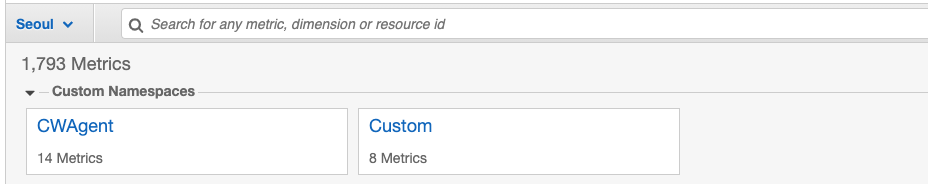
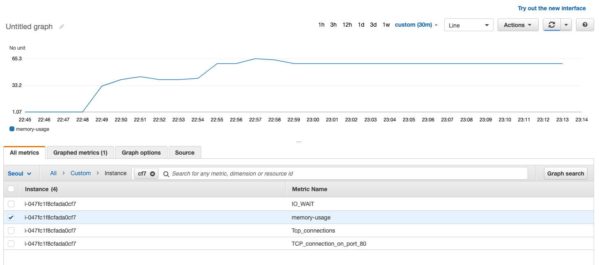
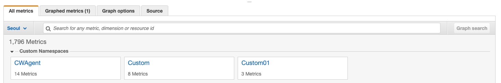
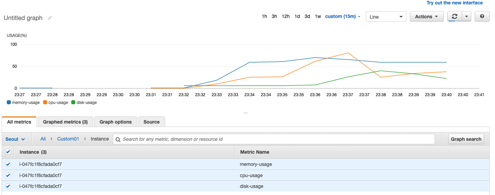

https://aws.amazon.com/ko/premiumsupport/knowledge-center/cloudwatch-custom-metrics/

**No need to install cloudwatch agent**

**AWS CLI Install**

```
https://docs.aws.amazon.com/ko_kr/cli/latest/userguide/install-cliv2-linux.html

ubuntu@ip-10-100-1-128:/home/ubuntu> curl "https://awscli.amazonaws.com/awscli-exe-linux-x86_64.zip" -o "awscliv2.zip"

ubuntu@ip-10-100-1-128:/home/ubuntu> unzip awscliv2.zip

ubuntu@ip-10-100-1-128:/home/ubuntu> sudo ./aws/install
You can now run: /usr/local/bin/aws --version

ubuntu@ip-10-100-1-128:/home/ubuntu> aws --version
aws-cli/2.1.13 Python/3.7.3 Linux/5.4.0-1030-aws exe/x86_64.ubuntu.18 prompt/off

```

```
ubuntu@ip-10-100-1-128:/home/ubuntu> curl http://169.254.169.254/latest/meta-data/instance-id;echo
i-047fc1f8cfada0cf7

ubuntu@ip-10-100-1-128:/home/ubuntu> vi mem.sh
ubuntu@ip-10-100-1-128:/home/ubuntu> chmod u+x mem.sh 
ubuntu@ip-10-100-1-128:/home/ubuntu> cat mem.sh 
#!/bin/bash
USEDMEMORY=$(free -m | awk 'NR==2{printf "%.2f\t", $3*100/$2 }')
TCP_CONN=$(netstat -an | wc -l)
TCP_CONN_PORT_80=$(netstat -an | grep 80 | wc -l)
IO_WAIT=$(iostat | awk 'NR==4 {print $5}')
 
aws cloudwatch put-metric-data --metric-name memory-usage --dimensions Instance=i-0c51f9f1213e63159  --namespace "Custom" --value $USEDMEMORY
aws cloudwatch put-metric-data --metric-name Tcp_connections --dimensions Instance=i-0c51f9f1213e63159  --namespace "Custom" --value $TCP_CONN
aws cloudwatch put-metric-data --metric-name TCP_connection_on_port_80 --dimensions Instance=i-0c51f9f1213e63159  --namespace "Custom" --value $TCP_CONN_PORT_80
aws cloudwatch put-metric-data --metric-name IO_WAIT --dimensions Instance=i-0c51f9f1213e63159  --namespace "Custom" --value $IO_WAIT

ubuntu@ip-10-100-1-128:~$ sed -i 's/i-0c51f9f1213e63159/i-047fc1f8cfada0cf7/g' mem.sh 

ubuntu@ip-10-100-1-128:/home/ubuntu> watch -n 10 ./mem.sh

```

```
https://unix.stackexchange.com/questions/99334/how-to-fill-90-of-the-free-memory

ubuntu@ip-10-100-1-128:~$ sudo apt-get install stress-ng

stress-ng --vm-bytes $(awk '/MemAvailable/{printf "%d\n", $2 * 0.4;}' < /proc/meminfo)k --vm-keep -m 1

ubuntu@ip-10-100-1-128:~$ stress-ng --vm-bytes $(awk '/MemAvailable/{printf "%d\n", $2 * 0.4;}' < /proc/meminfo)k --vm-keep -m 1

ubuntu@ip-10-100-1-128:~$ stress-ng --vm-bytes $(awk '/MemAvailable/{printf "%d\n", $2 * 0.6;}' < /proc/meminfo)k --vm-keep -m 1
```

**Customer Namespace => Customer Metric**

<kbd>  </kbd>

**EC2 memory Usage**

<kbd>  </kbd>

**Using custom metric to send multiple items**

```
ubuntu@ip-10-100-1-128:~$ cp mem.sh total.sh

ubuntu@ip-10-100-1-128:~$ cat total.sh 
#!/bin/bash
CPU_USAGE=$(top -b -n2 -p 1 | fgrep "Cpu(s)" | tail -1 | awk -F'id,' -v prefix="$prefix" '{ split($1, vs, ","); v=vs[length(vs)]; sub("%", "", v); printf "%s%.1f%%\n", prefix, 100 - v }')
USEDMEMORY=$(free -m | awk 'NR==2{printf "%.2f\t", $3*100/$2 }')
DISK_USAGE=$(df -h / | tail -1 | awk ' { print $5 }')
#TCP_CONN=$(netstat -an | wc -l)
#TCP_CONN_PORT_80=$(netstat -an | grep 80 | wc -l)
#IO_WAIT=$(iostat | awk 'NR==4 {print $5}')
CPU_USAGE=`echo $CPU_USAGE|sed -e 's/%//g'`
DISK_USAGE=`echo $DISK_USAGE|sed -e 's/%//g'`
echo $CPU_USAGE
echo $USEDMEMORY
echo $DISK_USAGE
 
aws cloudwatch put-metric-data --metric-name cpu-usage --dimensions Instance=i-047fc1f8cfada0cf7  --namespace "Custom01" --value $CPU_USAGE
aws cloudwatch put-metric-data --metric-name memory-usage --dimensions Instance=i-047fc1f8cfada0cf7  --namespace "Custom01" --value $USEDMEMORY
aws cloudwatch put-metric-data --metric-name disk-usage --dimensions Instance=i-047fc1f8cfada0cf7  --namespace "Custom01" --value $DISK_USAGE

ubuntu@ip-10-100-1-128:~$ watch -n 10 ./total.sh

```

**New Custom Namespace-Customer01 Created**

<kbd>  </kbd>

**Show multiple items**

<kbd>  </kbd>
