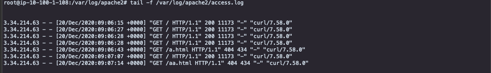

**Install cloudwatch agent and get siganature file**

```
Attach policy - CloudWatchAgentServerPolicy - to EC role


ubuntu@ip-10-100-1-108:/home/ubuntu> sudo apt-get install apache2
ubuntu@ip-10-100-1-108:/home/ubuntu> sudo service apache2 start

ubuntu@ip-10-100-1-108:/home/ubuntu> https://s3.amazonaws.com/amazoncloudwatch-agent/ubuntu/amd64/latest/amazon-cloudwatch-agent.deb

ubuntu@ip-10-100-1-108:/home/ubuntu> ls -alrt *.deb*
-rw-rw-r-- 1 ubuntu ubuntu 38406320 Nov  9 18:18 amazon-cloudwatch-agent.deb
-rw-rw-r-- 1 ubuntu ubuntu      287 Nov  9 18:18 amazon-cloudwatch-agent.deb.sig


ubuntu@ip-10-100-1-108:/home/ubuntu> wget https://s3.amazonaws.com/amazoncloudwatch-agent/assets/amazon-cloudwatch-agent.gpg

ubuntu@ip-10-100-1-108:/home/ubuntu>  gpg --import amazon-cloudwatch-agent.gpg

ubuntu@ip-10-100-1-108:/home/ubuntu>  gpg --import amazon-cloudwatch-agent.gpg
gpg: keybox '/home/ubuntu/.gnupg/pubring.kbx' created
gpg: /home/ubuntu/.gnupg/trustdb.gpg: trustdb created
gpg: key D58167303B789C72: public key "Amazon CloudWatch Agent" imported
gpg: Total number processed: 1
gpg:               imported: 1

ubuntu@ip-10-100-1-108:/home/ubuntu> gpg --fingerprint D58167303B789C72
pub   rsa2048 2017-11-14 [SC]
      9376 16F3 450B 7D80 6CBD  9725 D581 6730 3B78 9C72
uid           [ unknown] Amazon CloudWatch Agent

ubuntu@ip-10-100-1-108:/home/ubuntu> gpg --verify amazon-cloudwatch-agent.deb.sig 
gpg: assuming signed data in 'amazon-cloudwatch-agent.deb'
gpg: Signature made Thu Nov  5 01:14:09 2020 UTC
gpg:                using RSA key D58167303B789C72
gpg: Good signature from "Amazon CloudWatch Agent" [unknown]
gpg: WARNING: This key is not certified with a trusted signature!
gpg:          There is no indication that the signature belongs to the owner.
Primary key fingerprint: 9376 16F3 450B 7D80 6CBD  9725 D581 6730 3B78 9C72


ubuntu@ip-10-100-1-108:/home/ubuntu> sudo dpkg -i -E ./amazon-cloudwatch-agent.deb


```

**Create Role**

<kbd>  </kbd>

**Attach the role to EC2**

<kbd>  </kbd>


**Run cloudwatch agent wizard**

```
ubuntu@ip-10-100-1-108:/home/ubuntu> sudo /opt/aws/amazon-cloudwatch-agent/bin/amazon-cloudwatch-agent-config-wizard
=============================================================
= Welcome to the AWS CloudWatch Agent Configuration Manager =
=============================================================
On which OS are you planning to use the agent?
1. linux
2. windows
default choice: [1]:

Trying to fetch the default region based on ec2 metadata...
Are you using EC2 or On-Premises hosts?
1. EC2
2. On-Premises
default choice: [1]:

Which user are you planning to run the agent?
1. root
2. cwagent
3. others
default choice: [1]:

Do you want to turn on StatsD daemon?
1. yes
2. no
default choice: [1]:

Which port do you want StatsD daemon to listen to?
default choice: [8125]

What is the collect interval for StatsD daemon?
1. 10s
2. 30s
3. 60s
default choice: [1]:

What is the aggregation interval for metrics collected by StatsD daemon?
1. Do not aggregate
2. 10s
3. 30s
4. 60s
default choice: [4]:

Do you want to monitor metrics from CollectD?
1. yes
2. no
default choice: [1]:

Do you want to monitor any host metrics? e.g. CPU, memory, etc.
1. yes
2. no
default choice: [1]:

Do you want to monitor cpu metrics per core? Additional CloudWatch charges may apply.
1. yes
2. no
default choice: [1]:

Do you want to add ec2 dimensions (ImageId, InstanceId, InstanceType, AutoScalingGroupName) into all of your metrics if the info is available?
1. yes
2. no
default choice: [1]:

Would you like to collect your metrics at high resolution (sub-minute resolution)? This enables sub-minute resolution for all metrics, but you can customize for specific metrics in the output json file.
1. 1s
2. 10s
3. 30s
4. 60s
default choice: [4]:

Which default metrics config do you want?
1. Basic
2. Standard
3. Advanced
4. None
default choice: [1]:

Current config as follows:
{
        "agent": {
                "metrics_collection_interval": 60,
                "run_as_user": "root"
        },
        "metrics": {
                "append_dimensions": {
                        "AutoScalingGroupName": "${aws:AutoScalingGroupName}",
                        "ImageId": "${aws:ImageId}",
                        "InstanceId": "${aws:InstanceId}",
                        "InstanceType": "${aws:InstanceType}"
                },
                "metrics_collected": {
                        "collectd": {
                                "metrics_aggregation_interval": 60
                        },
                        "disk": {
                                "measurement": [
                                        "used_percent"
                                ],
                                "metrics_collection_interval": 60,
                                "resources": [
                                        "*"
                                ]
                        },
                        "mem": {
                                "measurement": [
                                        "mem_used_percent"
                                ],
                                "metrics_collection_interval": 60
                        },
                        "statsd": {
                                "metrics_aggregation_interval": 60,
                                "metrics_collection_interval": 10,
                                "service_address": ":8125"
                        }
                }
        }
}
Are you satisfied with the above config? Note: it can be manually customized after the wizard completes to add additional items.
1. yes
2. no
default choice: [1]:

Do you have any existing CloudWatch Log Agent (http://docs.aws.amazon.com/AmazonCloudWatch/latest/logs/AgentReference.html) configuration file to import for migration?
1. yes
2. no
default choice: [2]:

Do you want to monitor any log files?
1. yes
2. no
default choice: [1]:

Log file path:
/var/log/apache2/access.log
Log group name:
default choice: [access.log]

Log stream name:
default choice: [{instance_id}]

Do you want to specify any additional log files to monitor?
1. yes
2. no
default choice: [1]:

Log file path:
/var/log/apache2/error.log
Log group name:
default choice: [error.log]

Log stream name:
default choice: [{instance_id}]

Do you want to specify any additional log files to monitor?
1. yes
2. no
default choice: [1]:
2
Saved config file to /opt/aws/amazon-cloudwatch-agent/bin/config.json successfully.
Current config as follows:
{
        "agent": {
                "metrics_collection_interval": 60,
                "run_as_user": "root"
        },
        "logs": {
                "logs_collected": {
                        "files": {
                                "collect_list": [
                                        {
                                                "file_path": "/var/log/apache2/access.log",
                                                "log_group_name": "access.log",
                                                "log_stream_name": "{instance_id}"
                                        },
                                        {
                                                "file_path": "/var/log/apache2/error.log",
                                                "log_group_name": "error.log",
                                                "log_stream_name": "{instance_id}"
                                        }
                                ]
                        }
                }
        },
        "metrics": {
                "append_dimensions": {
                        "AutoScalingGroupName": "${aws:AutoScalingGroupName}",
                        "ImageId": "${aws:ImageId}",
                        "InstanceId": "${aws:InstanceId}",
                        "InstanceType": "${aws:InstanceType}"
                },
                "metrics_collected": {
                        "collectd": {
                                "metrics_aggregation_interval": 60
                        },
                        "disk": {
                                "measurement": [
                                        "used_percent"
                                ],
                                "metrics_collection_interval": 60,
                                "resources": [
                                        "*"
                                ]
                        },
                        "mem": {
                                "measurement": [
                                        "mem_used_percent"
                                ],
                                "metrics_collection_interval": 60
                        },
                        "statsd": {
                                "metrics_aggregation_interval": 60,
                                "metrics_collection_interval": 10,
                                "service_address": ":8125"
                        }
                }
        }
}
Please check the above content of the config.
The config file is also located at /opt/aws/amazon-cloudwatch-agent/bin/config.json.
Edit it manually if needed.
Do you want to store the config in the SSM parameter store?
1. yes
2. no
default choice: [1]:
2
Program exits now.

```

**cloudwatch agent configuration file**

```
ubuntu@ip-10-100-1-108:/home/ubuntu> cat /opt/aws/amazon-cloudwatch-agent/bin/config.json
{
        "agent": {
                "metrics_collection_interval": 60,
                "run_as_user": "root"
        },
        "logs": {
                "logs_collected": {
                        "files": {
                                "collect_list": [
                                        {
                                                "file_path": "/var/log/apache2/access.log",
                                                "log_group_name": "access.log",
                                                "log_stream_name": "{instance_id}"
                                        },
                                        {
                                                "file_path": "/var/log/apache2/error.log",
                                                "log_group_name": "error.log",
                                                "log_stream_name": "{instance_id}"
                                        }
                                ]
                        }
                }
        },
        "metrics": {
                "append_dimensions": {
                        "AutoScalingGroupName": "${aws:AutoScalingGroupName}",
                        "ImageId": "${aws:ImageId}",
                        "InstanceId": "${aws:InstanceId}",
                        "InstanceType": "${aws:InstanceType}"
                },
                "metrics_collected": {
                        "collectd": {
                                "metrics_aggregation_interval": 60
                        },
                        "disk": {
                                "measurement": [
                                        "used_percent"
                                ],
                                "metrics_collection_interval": 60,
                                "resources": [
                                        "*"
                                ]
                        },
                        "mem": {
                                "measurement": [
                                        "mem_used_percent"
                                ],
                                "metrics_collection_interval": 60
                        },
                        "statsd": {
                                "metrics_aggregation_interval": 60,
                                "metrics_collection_interval": 10,
                                "service_address": ":8125"
                        }
                }
        }
}
```


**Run cloudwatch agent with failure**

```
ubuntu@ip-10-100-1-108:/home/ubuntu> sudo /opt/aws/amazon-cloudwatch-agent/bin/amazon-cloudwatch-agent-ctl -a fetch-config -m ec2 -s -c file:/opt/aws/amazon-cloudwatch-agent/bin/config.json
/opt/aws/amazon-cloudwatch-agent/bin/config-downloader --output-dir /opt/aws/amazon-cloudwatch-agent/etc/amazon-cloudwatch-agent.d --download-source file:/opt/aws/amazon-cloudwatch-agent/bin/config.json --mode ec2 --config /opt/aws/amazon-cloudwatch-agent/etc/common-config.toml --multi-config default
Successfully fetched the config and saved in /opt/aws/amazon-cloudwatch-agent/etc/amazon-cloudwatch-agent.d/file_config.json.tmp
Start configuration validation...
/opt/aws/amazon-cloudwatch-agent/bin/config-translator --input /opt/aws/amazon-cloudwatch-agent/etc/amazon-cloudwatch-agent.json --input-dir /opt/aws/amazon-cloudwatch-agent/etc/amazon-cloudwatch-agent.d --output /opt/aws/amazon-cloudwatch-agent/etc/amazon-cloudwatch-agent.toml --mode ec2 --config /opt/aws/amazon-cloudwatch-agent/etc/common-config.toml --multi-config default
2020/12/20 09:00:03 Reading json config file path: /opt/aws/amazon-cloudwatch-agent/etc/amazon-cloudwatch-agent.d/file_config.json.tmp ...
Valid Json input schema.
I! Detecting runasuser...
No csm configuration found.
Configuration validation first phase succeeded
/opt/aws/amazon-cloudwatch-agent/bin/amazon-cloudwatch-agent -schematest -config /opt/aws/amazon-cloudwatch-agent/etc/amazon-cloudwatch-agent.toml
Configuration validation second phase failed
======== Error Log ========
2020-12-20T09:00:03Z E! [telegraf] Error running agent: Error parsing /opt/aws/amazon-cloudwatch-agent/etc/amazon-cloudwatch-agent.toml, open /usr/share/collectd/types.db: no such file or directory
```

**colletd required to run cloudwatch agent**

```
https://github.com/awsdocs/amazon-cloudwatch-user-guide/issues/54
ubuntu@ip-10-100-1-108:/home/ubuntu> sudo apt-get install collectd

```

```
ubuntu@ip-10-100-1-108:/home/ubuntu> sudo /opt/aws/amazon-cloudwatch-agent/bin/amazon-cloudwatch-agent-ctl -a fetch-config -m ec2 -s -c file:/opt/aws/amazon-cloudwatch-agent/bin/config.json
/opt/aws/amazon-cloudwatch-agent/bin/config-downloader --output-dir /opt/aws/amazon-cloudwatch-agent/etc/amazon-cloudwatch-agent.d --download-source file:/opt/aws/amazon-cloudwatch-agent/bin/config.json --mode ec2 --config /opt/aws/amazon-cloudwatch-agent/etc/common-config.toml --multi-config default
Successfully fetched the config and saved in /opt/aws/amazon-cloudwatch-agent/etc/amazon-cloudwatch-agent.d/file_config.json.tmp
Start configuration validation...
/opt/aws/amazon-cloudwatch-agent/bin/config-translator --input /opt/aws/amazon-cloudwatch-agent/etc/amazon-cloudwatch-agent.json --input-dir /opt/aws/amazon-cloudwatch-agent/etc/amazon-cloudwatch-agent.d --output /opt/aws/amazon-cloudwatch-agent/etc/amazon-cloudwatch-agent.toml --mode ec2 --config /opt/aws/amazon-cloudwatch-agent/etc/common-config.toml --multi-config default
2020/12/20 09:02:51 Reading json config file path: /opt/aws/amazon-cloudwatch-agent/etc/amazon-cloudwatch-agent.d/file_config.json.tmp ...
Valid Json input schema.
I! Detecting runasuser...
No csm configuration found.
Configuration validation first phase succeeded
/opt/aws/amazon-cloudwatch-agent/bin/amazon-cloudwatch-agent -schematest -config /opt/aws/amazon-cloudwatch-agent/etc/amazon-cloudwatch-agent.toml
Configuration validation second phase succeeded
Configuration validation succeeded
Created symlink /etc/systemd/system/multi-user.target.wants/amazon-cloudwatch-agent.service → /etc/systemd/system/amazon-cloudwatch-agent.service.
```

**get htlm from httpd using curl**

```
ubuntu@ip-10-100-1-108:/home/ubuntu> curl http://3.34.214.63
ubuntu@ip-10-100-1-108:/home/ubuntu> curl http://3.34.214.63/aa.html
```

**Check apache access.log**
<kbd>  </kbd>

**Check CloudWatch Log**
<kbd>  </kbd>


